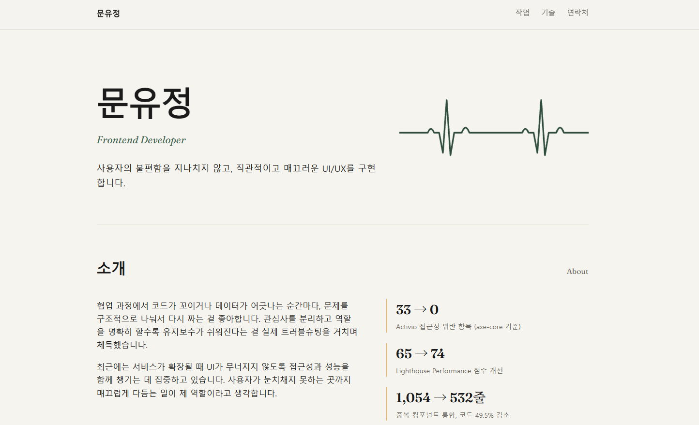

# 문유정 포트폴리오

> 사용자의 불편함을 지나치지 않고, 직관적이고 매끄러운 UI/UX를 구현하는 프론트엔드 개발자 문유정의 포트폴리오입니다.

🔗 **배포 링크**: [https://yoojeongm-portfolio.vercel.app/](https://yoojeongm-portfolio.vercel.app/)

---

## 미리보기



---

## 담긴 프로젝트

### 1. 나의 작은 마음 도서관 (Personalized Sentence Curation Site)

- 팀 문학소녀 · 2026.02.09 – 03.04 · Vanilla JS
- 사용자가 고른 날씨와 기분에 따라 문학 문장을 추천하는 웹 서비스
- 배포: [https://vanilla-project-team3.netlify.app/](https://vanilla-project-team3.netlify.app/)

### 2. 블랙벨트 → Activio (Redesign Case Study)

- 4인 팀 · 2026.04 ~
- 주짓수 전용 커뮤니티였던 블랙벨트를 유도·주짓수·레슬링·복싱·태권도·MMA를 아우르는 종합 무술 커뮤니티 Activio로 리디자인
- 접근성 개선, 캐싱 최적화, 리디자인 담당
- 배포: [Activio](https://activio-red.vercel.app/) · [Black-Belt](https://final-project-team3.vercel.app/)

---

## 기술 스택

- HTML5, CSS3 (Grid, Flexbox, CSS 변수)
- Google Fonts: Pretendard, Fraunces
- Vanilla JS 없이 순수 마크업 + 스타일로 구성 (별도 프레임워크·빌드 도구 없음)

---

## 폴더 구조

```
portfolio/
├── index.html
├── css/
│   └── style.css
├── images/
│   ├── sentence-main.png
│   ├── sentence-result.png
│   ├── blackbelt-community.png
│   ├── activio-community.png
│   ├── activio-dojang.png
│   └── activio-competition.png
│   ├── activio-admin.png
│   └── preview-hero.png
└── README.md
```

---

## 로컬에서 실행하기

```bash
git clone https://github.com/myj9713-dev/portfolio.git
cd portfolio
```

VS Code에서 폴더를 연 뒤, `index.html`을 우클릭하여 **Open with Live Server**로 실행하면 됩니다. 별도의 설치나 빌드 과정이 필요 없습니다.

---

## 연락처

- 이메일: [myj9713@gmail.com](mailto:myj9713@gmail.com)
- GitHub: [github.com/myj9713-dev](https://github.com/myj9713-dev)